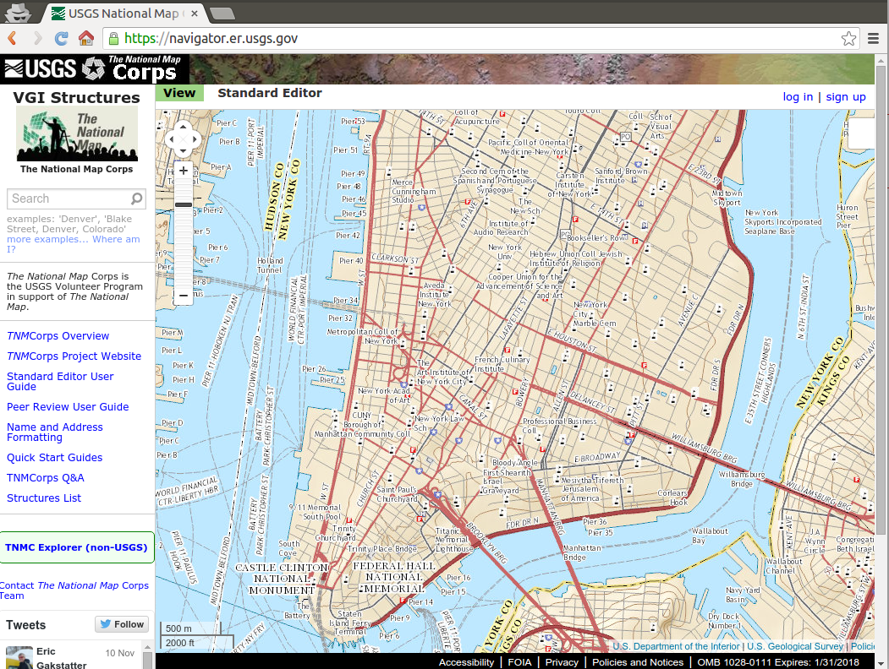

# Sinergias OSM-IGN

- Jorge Sanz · jsanz@cartodb.com
- 13 de Noviembre de 2013
- Instituto Geográfico Nacional

---

## La precisión, un clásico

Los datos de OSM tienen diferentes resoluciones y completitud

- geométrica
- temporal
- semántica

---

## La comunidad OSM

- pasión por la información geográfica
- discusión sobre la realidad cambiante
- procesos de definición de entidades
- mapping parties

---

## La experiencia del USGS

- Experiencia previa en VGI: _The National Map Corps_
- Proyecto piloto en 2010: [OSMCP](http://nationalmap.gov/TheNationalMapCorps/pilot.html)

----

## Dudas

- Precisión de la información (un clásico)
- Qué tareas que pueden solicitarse a voluntarios
- La ausencia de validadores (algo como los bibliotecarios de Wikipedia)
- Cómo motivar a los voluntarios
- ¿Qué tipo de estructura organizativa es la mejor? 
 - p.ej. OSM y Wikipedia operan de forma distinta
- Cómo integrar información de voluntarios con información _oficial_

----

## Dudas

- ¿Cuáles son los costes de mantener un programa de participación voluntaria?
- ¿Cuál es la sostenibilidad de este modelo? 
 - ¿Cómo mantener a los voluntarios activos a largo plazo?
- Los datos del USGS son Public Domain, no pueden integrar datos de OSM

> Muchas sin respuesta desde la academia o experiencia actual

---

## Fase 1 de OSMPC

> Tras evaluar diferentes opciones se decide utilizar el stack tecnológico de OSM

----

## Aspectos positivos

- OSM es un proyecto maduro que ofrece multitud de editores
- OSM es un stack relativamente fácil de usar y configurar
- Edición multiusuario bien resuelta

----

## Aspectos negativos:

- Hacen falta conocimientos en:
  - Ruby on Rails
  - Postgres
  - Linux
- Problemas para manejar entidades *muy* grandes
- Problemas de red con la DMZ del USGS
- La aproximación al control de calidad de OSM
  - OSM está enfocado a un control de calidad basado en la confianza en que un número suficiente de usuarios acabará detectando y corrigiendo errores.

---

## El proyecto cinco años después

----

## El proyecto cinco años después

- [The National Map Corps](http://nationalmap.gov/TheNationalMapCorps/)
- [Wiki](https://my.usgs.gov/confluence/display/nationalmapcorps/Home)
- [Manual](https://navigator.er.usgs.gov/help/WebHelp/Editing_Quick_Reference_Guide.pdf)
- Sistema en producción a nivel nacional

---

## Experiencia en Canadá

- [Resumen](http://web.ornl.gov/sci/gist/workshops/2012/documents/Begin,%20Daniel%20-%20Paper.pdf)
- Reducción sus operativos (recortes)
- Tampoco integran los datos directamente
- Donación a OSM como primer paso
- Seguimiento de cambios en OSM
- Evaluación de usuarios
- Preocupados por la motivación

---

## Otras formas de participación

- No solo se trata de _aprovechar_ los datos generados por usuarios
- El verdadero reto es conseguir generar una comunidad interesada en **colaborar**

----

## Ejemplos de actividades:

- Participación en activaciones del HOT
- Colaboración en *Mapping Parties*
- Donación de hardware/sistemas
- Formación y difusión conjunta en otras comunidades 
 - p.ej. grupo de periodismo de datos de Medialab

